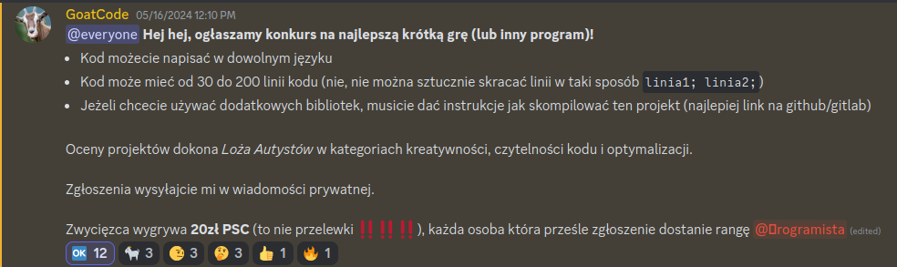

# Koza clicker
Gra stworzona na konkurs zapowiedziany na discord przez wielkiego Polaka [Goaten Koaden](https://www.youtube.com/@goatcode).

Głównym ograniczeniem w konkursie okazało się zmieszczenie kodu w 200 linijkach, przez co jego jakość jest słaba.

## O czym jest ta gra
Największymi dziełami GoatCode zawsze były clickery, [Kupa Clicker](https://play.google.com/store/apps/details?id=org.godotengine.kupagra) np. długo utrzymywała się w top 100 sklepu play. Bardzo mnie tym Goaten Koaden zainspirował, dlatego na konkurs stworzyłem własny, bardzo prosty clicker. Przez ograniczenie lini kodu nie ma w nim wiele urozmaiceń, ale sama gra dalej jest niezmiernie wciągająca!

## Instalacja
Do grania potrzebne jest posiadanie biblioteki [SFML 2.6.1](https://www.sfml-dev.org/download.php) i Unix File systemu. By zacząć swoją przygodę w koza clicker, wystarczy sklonować repo i odpalić plik koza_clicker. Można też samemu skompilować projekt używając makefilea, ale to zresetuje cały postęp.
